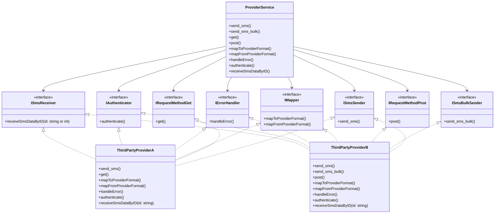

# SMS Gateway Service

**Note**: This is a code challenge implementation with limited development time. Due to the tight deadline, comprehensive unit tests were not included, though the architecture is designed to be easily testable with proper dependency injection and interface-based design.

## Provider Design
The SMS provider system follows a flexible interface-based design pattern. 




## Service Design 


## High Level Design


## Hardware Requirements Assumptions
**Note**: 
The following hardware/resource estimates are provided as baseline assumptions for running the SMS Gateway.
Some values are approximate and chosen for illustration (e.g., the RabbitMQ memory estimate is intentionally low — in practice, a production instance will require significantly more). \
[Hard Ware Assumptions](infrastruce_requirement_assumptions.md)   

## Features

- **Multi-Provider SMS Support**: Seamlessly switch between different SMS providers
- **Message Queuing**: RabbitMQ integration for reliable message processing
- **User Management**: API key-based authentication and user balance tracking
- **Dual Mode Operation**: Web service mode and consumer mode

## 🏗️ Architecture

The service follows a clean architecture pattern with clear separation of concerns:

```
├── api/                    # HTTP API layer
│   ├── dto/               # Data Transfer Objects
│   ├── handler/           # HTTP handlers
│   ├── middleware/        # HTTP middleware
│   └── router/            # Route definitions
├── cmd/                   # Application entry points
├── config/                # Configuration management
├── infrastructure/        # External service integrations
│   ├── cache/            # Redis cache layer
│   └── persistance/      # Database and message broker
├── logging/              # Structured logging implementation
├── model/                # Domain models and database entities
├── provider/             # SMS provider implementations
└── service/              # Business logic layer
```


## Installation & Setup

### 1. Clone the Repository

```bash
git clone <repository-url>
cd abrarvan_challenge
```

### 2. Environment Setup

The service supports multiple environments:
- `local` - For local development
- `docker` - For containerized deployment
- `production` - For production deployment

### 3. Docker Compose Setup

Start all required services:

```bash
docker-compose up -d
```

This will start:
- PostgreSQL database (port 5432)
- Redis cache (port 6379)
- RabbitMQ with management UI (ports 5672, 15672)
- PgAdmin for database management (port 8090)

### 4. Manual Setup (Alternative)

If you prefer manual setup:

```bash
# Install dependencies
cd src
go mod download

# Set environment
export APP_ENV=local

# Run database migrations (automatically handled on startup)
# Seed initial users (automatically handled on startup)

# Start the web service
go run cmd/main.go

# Or start in consumer mode
go run cmd/main.go -consumer -queue=my_queue
```

##  Usage

### Web Service Mode

The service exposes RESTful APIs:

#### Health Check
```bash
curl http://localhost:5005/api/health
```

#### Send SMS
```bash
curl -X POST http://localhost:5005/api/notificaiton/send-message \
  -H "Content-Type: application/json" \
  -d '{
    "message": "Hello World!",
    "phoneNumber": "09999948734"
  }'
```

### Consumer Mode

Start message consumers to process queued messages:

```bash
# Basic consumer
go run cmd/main.go -consumer -queue=my_queue

# Consumer with custom options
go run cmd/main.go -consumer -queue=my_queue \
  -consumer-name=worker-1 \
  -auto-ack=false \
  -queue-durable=true
```

### Available Command Line Options

| Flag | Description | Default |
|------|-------------|---------|
| `-consumer` | Run in consumer mode | false |
| `-queue` | Queue name to consume from | "" |
| `-queue-durable` | Queue durability | true |
| `-queue-autodelete` | Queue auto-delete | false |
| `-consumer-name` | Consumer name | "" |
| `-auto-ack` | Auto acknowledge messages | true |

##  Configuration

Configuration files are located in `src/config/`:

- `config-local.yml` - Local development
- `config-docker.yml` - Docker environment

### Key Configuration Sections

- **Server**: Port and runtime settings
- **Database**: PostgreSQL connection settings
- **Redis**: Cache configuration
- **RabbitMQ**: Message broker settings
- **Logging**: Log level and output settings

##  Database Schema

The service includes the following main entities:

- **Users**: API key management, balance tracking, rate limiting
- **Messages**: SMS message records with status tracking
- **Providers**: SMS provider configurations
- **BillingHistory**: Transaction and billing records


##  Logging

Structured logging with multiple output formats:

- **Console Output**: For development
- **File Output**: Rotated log files
- **JSON Format**: For log aggregation systems

Log categories include:
- Database operations
- Message queue operations  
- SMS provider interactions
- API requests/responses
- System events

## 🚦 API Endpoints

| Method | Endpoint | Description |
|--------|----------|-------------|
| GET | `/api/health` | Health check |
| POST | `/api/notificaiton/send-message` | Send SMS message |


## 🚀 Deployment

### Docker Deployment

```bash
# Build and run all services
docker-compose up --build

# Scale consumers
docker-compose up --scale consumer=3
```

### Manual Deployment

1. Set `APP_ENV=production`
2. Configure production database
3. Build binary: `go build -o sms-gateway ./cmd`
4. Run: `./sms-gateway`
